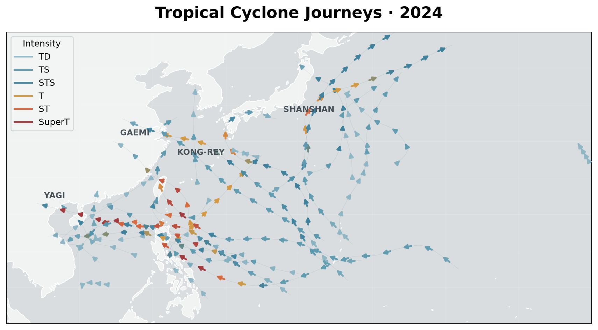

# Tropical Cyclone Journeys · 2024

## The phenomenon

Tropical cyclones are moving weather systems whose positions and intensities change over time. This project visualises the journeys of tropical cyclones recorded in the western North Pacific and the South China Sea during 2024.

I chose typhoon tracks because the data contains several dimensions at once: geographic position, time, and intensity. Instead of treating each observation as an isolated number, I wanted to turn the sequence of observations into visible journeys across the map.

## The source

The data comes from the Hong Kong Observatory's Tropical Cyclone Best Track Data (post analysis) for 2024.

Source: https://data.weather.gov.hk/weatherAPI/hko_data/tc/HKO2024BST.csv

The dataset contains 652 observation rows covering 28 tropical cyclones. Each row records a cyclone name, date and time, intensity category, latitude, and longitude. The raw CSV is kept unchanged in `data/HKO2024BST.csv`.

## What the picture shows

The static visualization treats each cyclone as a geographic journey. Latitude and longitude determine the position of each track, while colour represents tropical cyclone intensity. Lower-intensity systems form a quiet background, while stronger systems become more visually prominent. Directional arrows indicate the movement direction along the journeys.

The interactive version extends the same dataset by allowing one cyclone to be selected and its journey to be explored progressively. A slider moves through the cyclone's route and reveals its corresponding time, position, and recorded intensity.

The picture also hides some information. The static image compresses the temporal sequence of observations into continuous paths, so it does not show exactly when each cyclone reached a particular position. The interactive view restores part of this temporal dimension, but the smoothed paths are still a visual transformation rather than the original individual observation points.

## Run it

uv run plot.py

uv run --with streamlit --with plotly streamlit run app.py